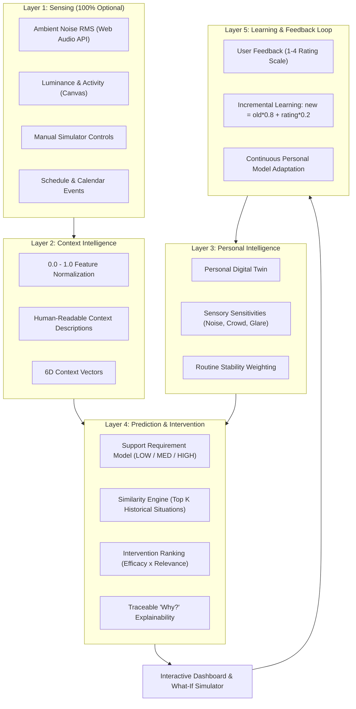

# ORION — Personalized AI for Proactive Autism Support

> **“It doesn't learn autism. It learns the individual.”**

ORION is a privacy-first AI support system that learns an individual's personal relationship between environmental stimuli, contextual demands, support requirements, and intervention effectiveness. 

Rather than attempting to diagnose, classify, or predict medical conditions, ORION forms a closed-loop **Personal Digital Twin** that estimates current **Support Requirement** (LOW / MEDIUM / HIGH) and suggests proactive, personalized accommodations based strictly on the individual’s own historical outcomes.

---

## 1. Important Product Boundary

ORION is **NOT** a medical diagnostic system.

Never implemented or claimed:
- Autism detection or diagnosis
- Emotion recognition
- Mental-state or psychological inference
- "Meltdown prediction"
- Medical emergency forecasting

Instead, ORION estimates:
```text
Current Support Requirement: HIGH
Confidence: 82%
Contributing Factors: High acoustic noise (88%) + High crowd density (82%) + Unexpected routine change
```
All recommendations and simulation metrics represent internal decision scores based on historical effectiveness, never clinical probabilities.

---

## 2. The Five-Layer Architecture

ORION’s architecture is structured around a closed personalization loop:



- **Layer 1 — Sensing**: Ephemeral ambient feature extraction (microphones extract volume levels in browser memory; cameras sample downscaled frames on canvas for brightness and activity deltas). No raw video or audio is ever stored or transmitted. Manual controls are always available.
- **Layer 2 — Context Intelligence**: Normalizes sensory signals into bounded features `[noise_level, crowd_level, brightness, activity_level, routine_change, unfamiliar_location]` and produces human-readable context descriptions.
- **Layer 3 — Personal Intelligence**: Maintains the individual's Personal Digital Twin (individual sensitivity thresholds and trigger load).
- **Layer 4 — Prediction & Intervention**:
  - Predicts Support Requirement (`LOW`, `MEDIUM`, `HIGH`) with confidence and contributing factors.
  - Matches the current situation against past occurrences using 6D vector distance.
  - Ranks proactive interventions (`score = historical_effectiveness * contextual_relevance`).
  - Generates transparent, traceable explanations rooted directly in user history.
- **Layer 5 — Learning & Feedback**: Records ratings (1=Not helpful to 4=Very helpful) and applies the transparent learning formula:
  $$\text{new\_score} = \text{old\_score} \times 0.8 + \text{feedback\_score} \times 0.2$$
  The personal model updates immediately, dynamically changing future rankings.

---

## 3. Technology Stack

- **Frontend**: React 19, TypeScript, Vite, Tailwind CSS, Lucide React, Recharts.
- **Backend**: Python 3.10+, FastAPI, Pydantic v2, SQLAlchemy 2.0, Scikit-learn, NumPy, Uvicorn, WebSockets.
- **Database**: PostgreSQL (Docker) / SQLite (Zero-dependency local development).
- **Sensing**: HTML5 Web Audio API (`AnalyserNode`) and HTML5 Canvas (ephemeral local luminance/motion deltas).
- **Containerization**: Docker, Docker Compose, Nginx.

---

## 4. Key Features & Interface

### A. Live Dashboard
- **Active Context Indicators**: Real-time gauges for noise, crowd, brightness, activity, routine changes, and physical locations.
- **Central Support Requirement Card**: Instant status (`LOW`, `MEDIUM`, `HIGH`), confidence rating, and sensitivity-weighted contributing factor bars.
- **Top Recommended Accommodations**: Ranked proactive strategies with individual recommendation scores and feedback submission triggers.
- **Traceable Explainability**: Explicit "Why?" evidence referencing similar past contexts.
- **Interactive Simulation Controls**: Instant sliders to test environmental shifts on the fly.

### B. Environment & Sensors
- Optional Web Audio API ambient noise analyzer with zero audio recording.
- Optional Canvas-based lighting and motion delta extraction with zero video recording.
- Clear privacy disclosures and status indicators.

### C. What-If Simulator
- Test counterfactual combinations of interventions (e.g. *No Intervention* vs. *Quiet Break* vs. *Quiet Break + Visual Schedule*).
- Comparative Recharts visualization illustrating simulated support load reductions.
- Explicit simulation disclaimer.

### D. Prep Mode
- Proactive event preparation planner (for presentations, transitions, or appointments).
- Pre-event contextual analysis comparing upcoming events with historical experiences to output actionable preparation checklists and sensory buffers.

### E. My Patterns (Analytics)
- Aggregated intervention effectiveness derived from recorded feedback.
- Common contextual trigger frequency distribution.
- Personal Digital Twin sensitivity profile weights.

### F. Privacy & Settings
- Comprehensive data transparency guarantees.
- Profile sensitivity threshold tuning sliders.
- One-click Judge Demo Data Reseed button.

### G. Onboarding Wizard
- 4-step personalized profile setup (Nickname, Difficult Situations, Helpful Strategies, Sensor Options).

---

## 5. Quick Start & Setup

### Local Development (Zero Setup)

#### 1. Backend Setup
```bash
cd backend
python -m venv venv

# Windows
.\venv\Scripts\activate
# Linux/macOS
source venv/bin/activate

pip install -r requirements.txt
uvicorn app.main:app --reload --port 8000
```
Backend runs at `http://127.0.0.1:8000`. Database automatically initializes SQLite and seeds Alex's demo profile and 25+ historical contexts.

#### 2. Frontend Setup
```bash
cd frontend
npm install
npm run dev
```
Open `http://localhost:5173` in your browser.

---

### Docker Compose Deployment

Run the complete multi-container stack (Frontend, Backend, PostgreSQL) with a single command:
```bash
docker compose up --build
```
- Frontend: `http://localhost:3000`
- Backend API & Swagger Docs: `http://localhost:8000/docs`
- PostgreSQL: Port `5432`

---

## 6. Hackathon Judge Demo Script

Follow this step-by-step sequence to verify the end-to-end closed loop:

1. **Open Dashboard**:
   - Access `http://localhost:5173`.
   - Confirm active profile: **Alex (Demo Profile v1)** with baseline historical contexts loaded.
2. **Adjust Environment**:
   - In the **Simulation / Demo Controls** panel, increase:
     - `Noise Level` $\rightarrow$ 88%
     - `Crowd Density` $\rightarrow$ 82%
     - `Lighting / Glare` $\rightarrow$ 75%
     - `Routine Change` $\rightarrow$ Active (ON)
3. **Observe Support Requirement Recalculation**:
   - Central card dynamically changes to **HIGH** with ~82% confidence.
   - Notice the sensitivity-weighted contributing factors breakdown highlighting Acoustic Load and Routine Shift.
4. **Inspect Traceable Explainability ("Why?")**:
   - Review the *Why This Recommendation?* card:
     > *"ORION analyzed current sensory load and identified similar historical situations. Most similar previous context was 'Campus Dining Hall' (92% match)."*
5. **Review Recommended Accommodations**:
   - Observe top-ranked interventions:
     1. **Quiet Break** (~91% recommendation score)
     2. **Noise Reduction** (~86%)
     3. **Visual Schedule** (~80%)
6. **Open What-If Simulator**:
   - Click **Simulate Support Options** or navigate to the *What-If Simulator* tab.
   - Compare scenarios: Notice how combining *Quiet Break + Visual Schedule* reduces projected support score from 86% (HIGH) to 39% (LOW).
7. **Submit Closed-Loop Feedback**:
   - Return to Dashboard or click **Provide Feedback** on *Quiet Break*.
   - Select **Very Helpful** (Rating 4).
   - Enter optional note: *"Hallway break helped decompress acoustic overload."*
   - Click **Submit & Update Model**.
8. **Verify Personal Model Learning**:
   - Observe the confirmation banner:
     > *"Personal model updated (v2). Intervention score increased by +0.03."*
   - Model version indicator in top navbar increments to **v2**.
9. **Inspect My Patterns**:
   - Navigate to **My Patterns**.
   - Confirm that *Quiet Break* reflects the newly recorded feedback with an increased sample count and higher effectiveness percentage.
10. **Explore Prep Mode & Privacy**:
    - Open **Prep Mode** to view pre-planned accommodations for Alex's upcoming *College Capstone Presentation*.
    - Open **Privacy** to verify zero-storage data policies and sensitivity adjustment sliders.

---

## 7. Automated Test Suite

Run the complete backend test suite:
```bash
cd backend
pytest tests/ -v
```

Tests validate:
- Layer 2 Context normalization and boundary defaults
- Layer 4A Support requirement threshold classification (`LOW`, `MEDIUM`, `HIGH`)
- Layer 4B Recommendation ranking and contextual relevance
- Layer 5 Feedback incremental learning formula (`new_score = old_score * 0.8 + feedback_score * 0.2`)
- What-If counterfactual scenario evaluations

---

## 8. Responsible AI & Ethical Boundaries

ORION is engineered with firm ethical safeguards:
- **No Diagnostics**: Never claims to diagnose autism or detect emotional states.
- **Privacy First**: Sensors operate client-side in memory; zero raw audio or video frames are ever recorded or stored.
- **Transparent Scoring**: Scoring rules and similarity weights are explainable and traceable to recorded user data, never opaque black-box probabilities.
- **Individual-Centric**: Learns only the specific user's idiosyncratic patterns and accommodations.
